# Lemma DAG

This is the sole canonical graph: node declarations, file targets, and direct dependency edges are maintained only in the Mermaid block below. `A --> B` means that B uses A as a mathematical input (including a definition or a reused proof argument). Plain-text citations inside proofs are not a second graph. Shared standard inputs are documented in [foundations](foundations/notation-and-inputs.md), outside this graph of proved results.

All 57 lemmas and Corollary 32a are represented. Corollary 32a proves an equivalence only; all-degree positivity and RH remain unproved and are not established input nodes. Where diagram links are unavailable, the `click` lines provide the relative file paths.

```mermaid
flowchart TD
  L001["L001: an absolutely convergent reciprocal"]
  click L001 "lemmas/L001-an-absolutely-convergent-reciprocal.md"
  L002["L002: conjugation preserves zeros and multiplicities"]
  click L002 "lemmas/L002-conjugation-preserves-zeros-and-multiplicities.md"
  L003["L003: reflection orbits in the open critical strip"]
  click L003 "lemmas/L003-reflection-orbits-in-the-open-critical-strip.md"
  L004["L004: a counterexample to the symmetry-only inference"]
  click L004 "lemmas/L004-a-counterexample-to-the-symmetry-only-inference.md"
  L005["L005: the Euler-product logarithm on its actual domain"]
  click L005 "lemmas/L005-the-euler-product-logarithm-on-its-actual-domain.md"
  L006["L006: a nonnegative trigonometric polynomial gives a product inequality"]
  click L006 "lemmas/L006-a-nonnegative-trigonometric-polynomial-gives-a-product-inequality.md"
  L007["L007: nonvanishing on Re(s)=1"]
  click L007 "lemmas/L007-nonvanishing-on-re-s-1.md"
  L008["L008: residue at 1 and the value at 0"]
  click L008 "lemmas/L008-residue-at-1-and-the-value-at-0.md"
  L009["L009: complete classification outside the open strip"]
  click L009 "lemmas/L009-complete-classification-outside-the-open-strip.md"
  L010["L010: the positive prime-logarithm representation diverges at and left of 1"]
  click L010 "lemmas/L010-the-positive-prime-logarithm-representation-diverges-at-and-left-of-1.md"
  L011["L011: the continued product inequality is false"]
  click L011 "lemmas/L011-the-continued-product-inequality-is-false.md"
  L012["L012: a convergent alternating representation in Re(s)>0"]
  click L012 "lemmas/L012-a-convergent-alternating-representation-in-re-s-0.md"
  L013["L013: no real zeros in the open strip"]
  click L013 "lemmas/L013-no-real-zeros-in-the-open-strip.md"
  L014["L014: a positive-kernel Laplace representation"]
  click L014 "lemmas/L014-a-positive-kernel-laplace-representation.md"
  L015["L015: a nonnegative indicator kernel can have zeros inside the strip"]
  click L015 "lemmas/L015-a-nonnegative-indicator-kernel-can-have-zeros-inside-the-strip.md"
  L016["L016: theta transformation and exponential tails"]
  click L016 "lemmas/L016-theta-transformation-and-exponential-tails.md"
  L017["L017: split Mellin integral with entire remainder"]
  click L017 "lemmas/L017-split-mellin-integral-with-entire-remainder.md"
  L018["L018: entire completion and exact zero correspondence"]
  click L018 "lemmas/L018-entire-completion-and-exact-zero-correspondence.md"
  L019["L019: the theta boundary derivative and a positive kernel"]
  click L019 "lemmas/L019-the-theta-boundary-derivative-and-a-positive-kernel.md"
  L020["L020: entire Fourier cosine representation of Ξ"]
  click L020 "lemmas/L020-entire-fourier-cosine-representation-of.md"
  L021["L021: imaginary-axis positivity and moment coefficients"]
  click L021 "lemmas/L021-imaginary-axis-positivity-and-moment-coefficients.md"
  L022["L022: positive smooth superexponential kernels do not force real zeros"]
  click L022 "lemmas/L022-positive-smooth-superexponential-kernels-do-not-force-real-zeros.md"
  L023["L023: an unconditional entire growth bound"]
  click L023 "lemmas/L023-an-unconditional-entire-growth-bound.md"
  L024["L024: an unconditional paired Hadamard product"]
  click L024 "lemmas/L024-an-unconditional-paired-hadamard-product.md"
  L025["L025: moment coefficients and reciprocal-zero power sums"]
  click L025 "lemmas/L025-moment-coefficients-and-reciprocal-zero-power-sums.md"
  L026["L026: an elementary zero-free rectangle for Ξ"]
  click L026 "lemmas/L026-an-elementary-zero-free-rectangle-for.md"
  L027["L027: six positive reciprocal-power sums and a strict moment inequality"]
  click L027 "lemmas/L027-six-positive-reciprocal-power-sums-and-a-strict-moment-inequality.md"
  L028["L028: a degree-two Jensen polynomial is real-rooted"]
  click L028 "lemmas/L028-a-degree-two-jensen-polynomial-is-real-rooted.md"
  L029["L029: even all positive scalar power sums do not force real zeros"]
  click L029 "lemmas/L029-even-all-positive-scalar-power-sums-do-not-force-real-zeros.md"
  L030["L030: convergent mixed quadratic forms"]
  click L030 "lemmas/L030-convergent-mixed-quadratic-forms.md"
  L031["L031: a mixed test detects the finite counterexample"]
  click L031 "lemmas/L031-a-mixed-test-detects-the-finite-counterexample.md"
  L032["L032: polynomial detection of a nonreal summable node"]
  click L032 "lemmas/L032-polynomial-detection-of-a-nonreal-summable-node.md"
  C032a["C032a: an explicit RH-equivalent condition, not a proof of it"]
  click C032a "lemmas/C032a-an-explicit-rh-equivalent-condition-not-a-proof-of-it.md"
  L033["L033: the first mixed determinant in moment coordinates"]
  click L033 "lemmas/L033-the-first-mixed-determinant-in-moment-coordinates.md"
  L034["L034: small zero arguments do not ensure a mixed determinant sign"]
  click L034 "lemmas/L034-small-zero-arguments-do-not-ensure-a-mixed-determinant-sign.md"
  L035["L035: explicit uniform tails for the first five moments"]
  click L035 "lemmas/L035-explicit-uniform-tails-for-the-first-five-moments.md"
  L036["L036: validated midpoint Taylor panels"]
  click L036 "lemmas/L036-validated-midpoint-taylor-panels.md"
  L037["L037: enclosures used by the finite certificate"]
  click L037 "lemmas/L037-enclosures-used-by-the-finite-certificate.md"
  L038["L038: a certified positive first mixed determinant"]
  click L038 "lemmas/L038-a-certified-positive-first-mixed-determinant.md"
  L039["L039: moment tails through any fixed even degree"]
  click L039 "lemmas/L039-moment-tails-through-any-fixed-even-degree.md"
  L040["L040: a justified finite Newton recurrence"]
  click L040 "lemmas/L040-a-justified-finite-newton-recurrence.md"
  L041["L041: a certified positive H_2 test"]
  click L041 "lemmas/L041-a-certified-positive-h-2-test.md"
  L042["L042: absolutely convergent Vandermonde expansion"]
  click L042 "lemmas/L042-absolutely-convergent-vandermonde-expansion.md"
  L043["L043: ordinary moment matrices are strictly positive definite"]
  click L043 "lemmas/L043-ordinary-moment-matrices-are-strictly-positive-definite.md"
  L044["L044: ordinary Gram positivity does not survive the needed logarithm map"]
  click L044 "lemmas/L044-ordinary-gram-positivity-does-not-survive-the-needed-logarithm-map.md"
  L045["L045: strict log-concavity of each theta-kernel summand"]
  click L045 "lemmas/L045-strict-log-concavity-of-each-theta-kernel-summand.md"
  L046["L046: the variance obstruction in a sum of log-concave terms"]
  click L046 "lemmas/L046-the-variance-obstruction-in-a-sum-of-log-concave-terms.md"
  L047["L047: strict log-concavity of the full theta kernel"]
  click L047 "lemmas/L047-strict-log-concavity-of-the-full-theta-kernel.md"
  L048["L048: smooth even extension and monotonicity of K"]
  click L048 "lemmas/L048-smooth-even-extension-and-monotonicity-of-k.md"
  L049["L049: strict log-concavity alone still does not force real zeros"]
  click L049 "lemmas/L049-strict-log-concavity-alone-still-does-not-force-real-zeros.md"
  L050["L050: a small superexponential mixture remains strictly log-concave"]
  click L050 "lemmas/L050-a-small-superexponential-mixture-remains-strictly-log-concave.md"
  L051["L051: order at most one for superexponential Fourier kernels"]
  click L051 "lemmas/L051-order-at-most-one-for-superexponential-fourier-kernels.md"
  L052["L052: tuning the introduced zeros into the strip"]
  click L052 "lemmas/L052-tuning-the-introduced-zeros-into-the-strip.md"
  L053["L053: a differential equation for the comparison base transform"]
  click L053 "lemmas/L053-a-differential-equation-for-the-comparison-base-transform.md"
  L054["L054: every comparison-base zero is real and outside the small rectangle"]
  click L054 "lemmas/L054-every-comparison-base-zero-is-real-and-outside-the-small-rectangle.md"
  L055["L055: the combined generic conditions admit nonreal zeros"]
  click L055 "lemmas/L055-the-combined-generic-conditions-admit-nonreal-zeros.md"
  L056["L056: every finite comparison-base Hankel matrix is positive definite"]
  click L056 "lemmas/L056-every-finite-comparison-base-hankel-matrix-is-positive-definite.md"
  L057["L057: any fixed number of Hankel tests can coexist with nonreal zeros"]
  click L057 "lemmas/L057-any-fixed-number-of-hankel-tests-can-coexist-with-nonreal-zeros.md"
  L002 --> L003
  L001 & L005 --> L006
  L001 & L006 --> L007
  L001 & L007 & L008 --> L009
  L002 & L008 --> L011
  L008 --> L012
  L009 & L012 --> L013
  L012 --> L014
  L016 --> L017
  L001 & L007 & L009 & L017 --> L018
  L016 --> L019
  L017 & L018 & L019 --> L020
  L019 & L020 --> L021
  L021 --> L022
  L018 & L019 & L020 --> L023
  L018 & L021 & L023 --> L024
  L018 & L021 & L024 --> L025
  L016 & L018 & L020 --> L026
  L019 & L021 & L024 & L025 & L026 --> L027
  L021 & L027 --> L028
  L018 & L024 & L025 --> L030
  L029 & L030 --> L031
  L018 & L024 & L026 & L030 & L032 --> C032a
  L021 & L025 & L027 & L030 --> L033
  L027 --> L034
  L019 & L021 --> L035
  L035 & L036 --> L037
  L027 & L033 & L035 & L036 & L037 --> L038
  L035 --> L039
  L021 & L025 & L030 --> L040
  L030 & L036 & L037 & L039 & L040 --> L041
  L024 & L025 & L027 & L030 --> L042
  L019 & L021 --> L043
  L022 & L043 --> L044
  L035 --> L045
  L045 --> L046
  L045 & L046 --> L047
  L016 & L019 & L047 --> L048
  L044 & L046 --> L049
  L022 & L046 --> L050
  L050 & L051 --> L052
  L052 --> L053
  L053 --> L054
  L021 & L050 & L051 & L052 & L054 --> L055
  L024 & L030 & L051 & L054 --> L056
  L024 & L025 & L040 & L051 & L055 & L056 --> L057
```

